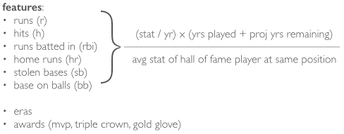
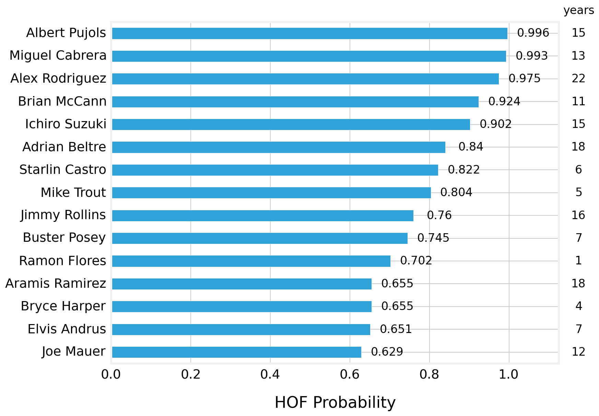
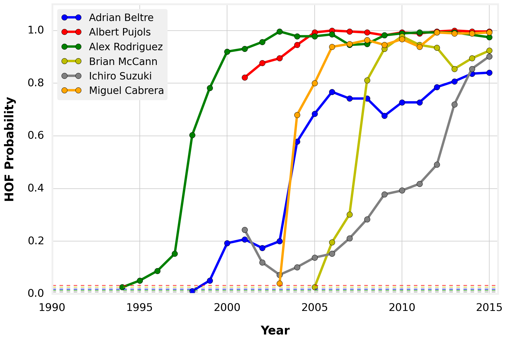
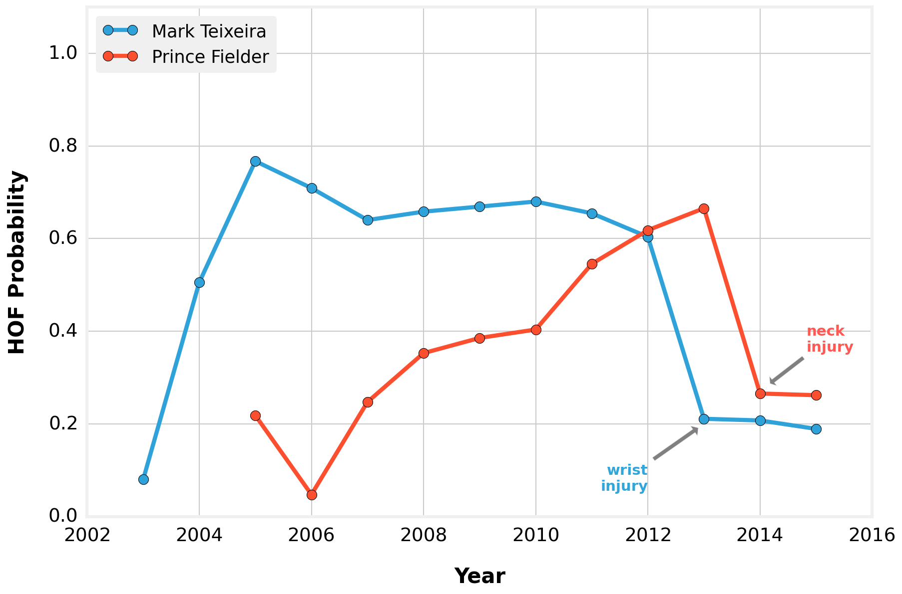
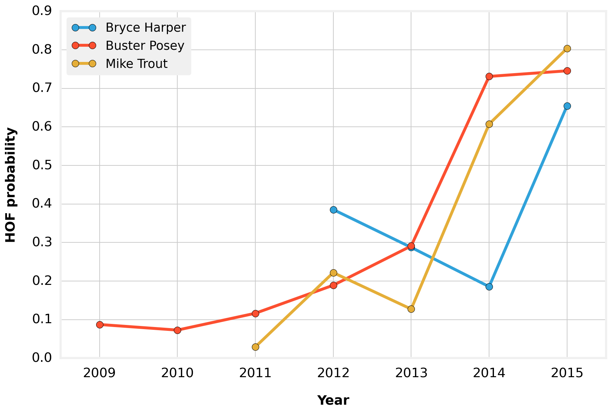
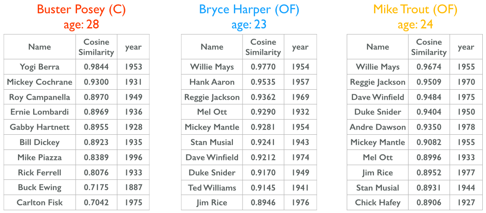
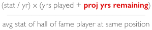

# Baseball Hall of Fame Predictor

## Table of Contents
* [Background](#background)
* [Process](#process)
* [Results](#results)
* [Future Direction](#future-direction)
* [Packages used](#packages-used)

## Background

The National Baseball Hall of Fame (HOF) in Cooperstown, NY honors the best of those who have played, managed, and served the sport of baseball. The goal of this project was twofold:

1. To determine the HOF worthiness of Major League Baseball (MLB) position players who were still currently playing as of the 2015 season. A player's HOF worthiness is usually gauged by his entire body of work after the player retires, but can we get a sense of which currently active players in MLB are playing at a level which puts them on pace to be joining the HOF in the future?

2. To determine which Hall of Famers (HOFers) some of the most noteworthy active MLB position players are most similar to.

iPython notebooks containing exploratory analysis and tinkering are under the [notebooks](https://github.com/apyeh/BaseballHOF/tree/master/notebooks) folder.

Code for the data cleaning/processing (clean\_data.py), model building (model\_building.py), and visualizations (analysis.py) are under the [code](https://github.com/apyeh/BaseballHOF/tree/master/code) folder.

## Process

The process used in this project involved four main steps, outlined  in Figure 1a below.

**Figure 1a.** Overview of the steps taken in this project.

Each of these steps is elaborated in further detail as follows:

1. The data (in .csv format), which included baseball statistics up through the end of the 2015 MLB season, was obtained from [Sean Lahman's Baseball Database](http://www.seanlahman.com/baseball-archive/statistics/) and can be found under [data](https://github.com/apyeh/BaseballHOF/tree/master/data) folder.

2. Data processing was done in [pandas](http://pandas.pydata.org). Current players at each position (i.e., C, 1B, 2B, 3B, SS, OF) were compared to HOFers at the same corresponding positions. The process of determining which features to include in the model involved feature engineering, whereby the traditional baseball counting statistics (runs, hits, runs batted in, home runs, stolen bases, and base on balls) were converted to rate statistics that measured the rate at which a current player at a certain position was producing in a particular statistical category compared to the average statistics of a HOFer at that same position. The specific formula used to compute this rate statistic is shown below in Figure 1b.

	**Figure 1b.** Feature engineering involved converting traditional baseball counting statistics to rate statistics. Additional features that were tested include the various baseball eras and awards players earned during their careers.

	

	

	Other features such as the different baseball eras (e.g., dead-ball era, live-ball era, steroid era, etc.) and individual player awards (i.e., MVP, triple crowns, and gold gloves) were also tested in the feature set but ultimately were not included as they did not improve the model.

	
3. Model building was done using machine learning algorithms from [scikit-learn](http://scikit-learn.org). Different classification models such as logistic regression, decision trees, gradient-boosting, k-nearest neighbors (kNN), support vector machine (SVM), and random forest (RF) were tried and compared using cross-validation methods. Since the percentage of players voted into the Hall of Fame is small, resulting in a somewhat imbalanced class, oversampling was also tried to try to improve the model.

	In the end, a random forest classifier without oversampling proved to be the best model based on the f1-score. The various metrics for this model are shown below in Table 1 below.
	

	**Table 1.** Metrics of the best random forest classification model.

	| Metric 			 |	Value|
	|-----------------|------|
	| accuracy        | 0.92 |
	| recall          | 0.72 |
	| precision       | 0.94 |
	| f1-score        | 0.82 |

4. Upon model building and selection, the model was used to predict which currently active MLB position players have the highest probability of being inducted into the HOF at their current cumulative level of production. Some of these players were then compared to HOFers at the same stage in their careers to determine which HOFers they are most similar to. These results are discussed in greater detail in the following section.

## Results

### The HOF worthy

The top 15 current MLB position players who have the highest chance of joining the Hall of Fame are shown below in Figure 2. The list comprises a mix of veteran as well as younger players, with Albert Pujols topping the list with a 99.6% chance of making it to the HOF.

**Figure 2.** Top 15 current MLB position players with the highest probabilities of entering the Hall of Fame along with the number of years played in MLB.

### Career Tracking

Looking at the top six players in the above list more closely, we can track their HOF probability trajectory over the course of their careers (Figure 3). 

**Figure 3.** Hall of Fame career trajectory of top six players from Figure 2.

A player such as Albert Pujols was producing at a HOF caliber level from the outset of his career and has sustained that level of play throughout his career. Miguel Cabrera also quickly established himself as a projected HOFer early in his career while other players required a few years before their HOF probabilities crossed the 50% threshold. Ichiro Suzuki is a particularly interesting case in this regard as his trajectory of making it to the HOF was the most gradual of these top six players. This is reflective of the fact that Ichiro played the first nine seasons of his professional baseball career in Japan's Nippon Professional Baseball (NPB) and did not begin his MLB career until age 27. The statistics which he compiled in the NPB were not counted in calculating his MLB HOF proability. If they had been, Ichiro's HOF career trajectory would have looked more in line with those of the other top players. Instead, with the late start to his American professional baseball career and fewer projected number of years in the MLB to produce HOF-worthy numbers, Ichiro had some catching up to do. His sustained excellent production since joining the MLB has compensated for this late start and has firmly placed him among current players with the best chance of joining the HOF.

### Derailed by Injuries

Injuries can often derail a professional athlete's career and their potential candidacy for the HOF. Such was the case for Mark Teixeira and Prince Fielder, two premier first basemen in the prime of their careers during which time they looked to be well on their way to producing HOF-worthy numbers (Figure 4). However, significant injuries cost both an entire season, resulting in their HOF chances to decrease dramatically.

**Figure 4.** Major injuries can derail the once-promising HOF chances of players.

### The Up and Comers

Some of the younger players from the top 15 list in Figure 1 include Bryce Harper, outfielder (OF) for the Washington Nationals, Buster Posey, catcher (C) for the San Francisco Giants, and Mike Trout, outfielder (OF) for the Los Angeles Angels of Anaheim, who have played four, seven, and five years in the MLB, respectively. In just these few years, they have established themselves as some of the best young superstars of the game and are currently on pace (barring any major setbacks such as injuries) to join the HOF, with their current HOF probabilities at 65.5% (Harper), 74.5% (Posey), and 80.4% (Trout) as of the end of the 2015 season (Figure 5).

**Figure 5.** Examples of three of the young superstars of MLB who have quickly established themselves as potential future HOF inductees.

### Most Similar HOFers

These three players were then compared, via cosine similarity, to HOFers who played at the same position and at the same stage in their careers to determine which HOFers these young superstars are most similar to (Figure 6). The analysis revealed that catcher Buster Posey in his age 28 season is most similar to HOF catcher Yogi Berra during his age 28 season while both outfielders Bryce Harper and Mike Trout in their age 23 and 24 seasons are most similar to HOF outfielder Willie Mays in his ages 23 and 24 seasons.

**Figure 6.** The top 10 HOFers most similar to Posey, Harper, and Trout.

## Future Direction

* Model improvements to account for aging / declining production.
	
	Currently, in the feature engineered rate statistic, the projected number of years remaining (highlighted in red below) in a current player's career is calculated by subtracting a player's current age from the average retirement age of a MLB player at that same position. This method of calculating the projected number of years remaining assumes that a player's production remains constant over the course of his career and does does not take into consideration the gradual decline in production that most players experience as they age. A more accurate term would incorporate a factor reflecting this decline in production over time.

	

* Use more advanced baseball metrics (e.g., WAR, adjusted OPS+)

	More advanced baseball metrics, such as wins above replacement (WAR) and adjusted on-base plus slugging percentages (OPS+) could be incorporated to assess if they improve the model.
	
* Extend model to pitchers

	Extending the model to include pitching statistics would allow for predicting which active MLB pitchers are on track to becoming HOFers.

## Packages used

* matplotlib
* NumPy
* pandas
* pickle
* scikit-learn

